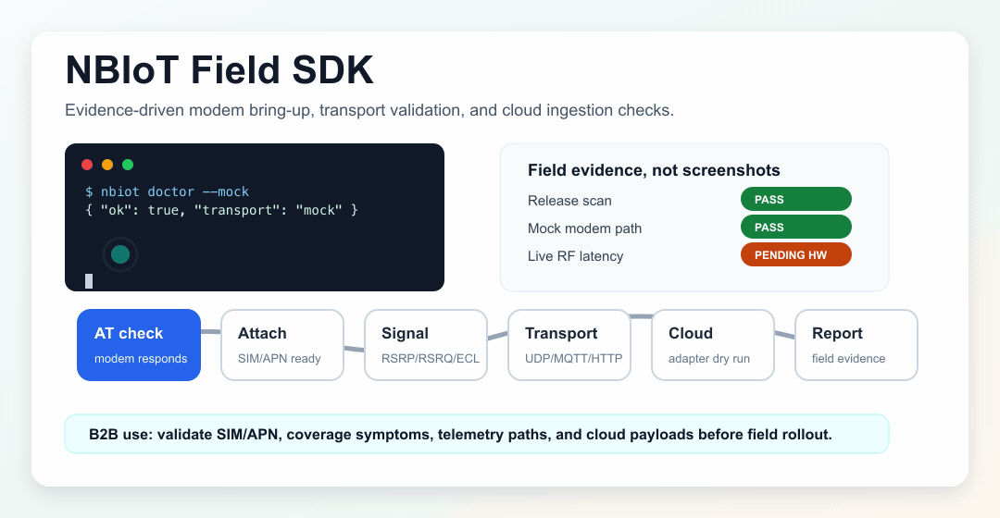

# NBIoT Field SDK

B2B NB-IoT field SDK and CLI for bringing up cellular IoT devices, validating SIM/APN and radio attach, sending telemetry over UDP/TCP/MQTT/HTTP, and checking cloud ingestion paths before a deployment reaches customers.

This repository turns an old Arduino + Python NB-IoT weather-station demo into a public, product-oriented toolkit. The commercial value is **B2B**: IoT solution vendors, system integrators, utilities, industrial teams, and telecom field teams can use it to reduce deployment risk and shorten the time from device prototype to validated field telemetry.



## What It Does

- Talks to u-blox SARA N2/N3 NB-IoT modems through AT commands.
- Validates modem responsiveness, attach state, registration state, signal quality, ping, and UDP send path.
- Provides dry-run and mockable cloud adapters for UDP, TCP, MQTT, HTTP, AllThingsTalk, AWS IoT, Azure IoT, and ThingsBoard.
- Decodes the original 14-byte weather-station payload: temperature, humidity, pressure, latitude, longitude.
- Generates field reports that can be attached to customer, operator, or deployment debugging tickets.
- Includes an Arduino firmware example with no hardcoded credentials or internal endpoints.

## Who Buys It

- **IoT device companies** use it to validate hardware and modem firmware before shipping devices.
- **System integrators** use it to prove that a customer site has NB-IoT coverage and working telemetry before committing installation labor.
- **Telecom/operator teams** use it as a repeatable field test harness for SIM/APN/profile issues.
- **Industrial and utility teams** use it to de-risk smart meter, asset tracker, environmental sensing, and remote monitoring rollouts.

It is not a consumer app. A normal consumer does not have the required modem, SIM, APN, firmware, and cloud ingestion setup.

## Evidence and Results

The public README uses generated workflow evidence and reproducible local benchmarks. It does not claim live attach latency, RF coverage, RSSI/RSRP/RSRQ quality, UDP RTT, power draw, or real cloud latency until those are measured with physical modem hardware, a SIM/APN, operator coverage, and user-provided cloud credentials.

Regenerate the tables and local benchmark data with:

```bash
bun run assets:hero
bun run benchmark
```

<!-- results:start -->
Measured on 2026-05-16 with Bun 1.3.11 on Apple Silicon local development machine. These are local SDK checks only; real RF/network numbers require physical hardware, SIM/APN, operator coverage, and cloud credentials.

### Results At A Glance

| Check | Result | Evidence |
| --- | --- | --- |
| Public file hygiene | PASS | Public scan passed. |
| Unit tests | PASS | bun test completed in the local benchmark run |
| Typecheck/lint gate | PASS | bun run typecheck completed; lint uses the same tsc gate |
| CLI command surface | PASS | doctor, connect, stats, ping, send, cloud test, decode, report, passthrough |
| Cloud adapter surface | PASS | UDP, TCP, MQTT, HTTP, AllThingsTalk, AWS IoT, Azure IoT, ThingsBoard |
| Hero visual | PASS | Generated docs/assets/hero-workflow.gif from synthetic workflow frames |

### Local SDK Benchmark

| Task | Command | Runs | Median | Range | Claim Scope |
| --- | --- | --- | --- | --- | --- |
| Mock modem doctor | `nbiot doctor --mock` | 5 | 23.3 ms | 21.9-27.9 ms | Mock AT transport, no modem required |
| Weather payload decode | `nbiot decode --hex <14-byte sample>` | 5 | 20.6 ms | 19.9-21.9 ms | Local codec only |
| UDP request construction | `nbiot send udp --dry-run` | 5 | 19.1 ms | 18.5-19.9 ms | Local dry run, TEST-NET endpoint |
| Cloud adapter dry run | `nbiot cloud test --provider thingsboard --dry-run` | 5 | 18.6 ms | 17.9-19.7 ms | Local request planning, no publish |
| Unit test suite | `bun test` | 1 | 54 ms | 54-54 ms | Local test suite |
| TypeScript validation | `bun run typecheck` | 1 | 496.2 ms | 496.2-496.2 ms | Static validation |

### Hardware Acceptance Matrix

| Metric | Status | Evidence Needed Before Claiming |
| --- | --- | --- |
| Serial modem detection | Pending hardware validation | u-blox SARA N2/N3 connected over serial and responding to AT |
| Network attach latency | Pending hardware validation | SIM/APN/operator attach run with timestamped field report |
| Signal quality | Pending hardware validation | RSRP, RSRQ, RSSI, registration, and ECL captured at field site |
| UDP RTT / delivery | Pending hardware validation | Real network UDP send and server receipt log |
| Cloud ingestion latency | Pending hardware validation | Live AllThingsTalk/AWS/Azure/ThingsBoard credentialed publish |
| Power draw / PSM/eDRX | Pending hardware validation | External power measurement and modem power-mode trace |

### SOTA / Ecosystem Comparison

| Tool | Public Scope | Hardware Scope | Honest Comparison |
| --- | --- | --- | --- |
| [NBIoT Field SDK](https://github.com/bozliu/NBIoT) | B2B field SDK/CLI for bring-up, dry-run transports, cloud adapters, reports | Implemented u-blox SARA N2/N3 path; Quectel/SIMCom planned | This repo: local tests, scans, generated benchmark |
| [SODAQ nbIOT](https://www.arduinolibraries.info/libraries/sodaq_nb-iot) | Arduino library for uBlox NB-IoT modules | u-blox NB-IoT module family | Strong firmware precedent; not a host-side B2B report/benchmark CLI |
| [AllThingsTalk Python SDK](https://docs.allthingstalk.com/developers/sdk/python/) | Python SDK for AllThingsTalk device/platform access | Cloud SDK, not modem field diagnostics | Good cloud target; narrower than multi-cloud field validation |
| [PyPI nbiot](https://pypi.org/project/nbiot/) | NB-IoT scanner and coverage tool for rollout troubleshooting | u-blox SARA N211 serial module | Closest open field-diagnostics precedent; narrower cloud adapter surface |
| [SimpleNB](https://github.com/techstudio-design/SimpleNB) | Arduino NB-IoT/CAT-M1 AT-command library | SIMCom, Quectel, u-blox SARA-R/N families; not SARA-N2 | Broader firmware module list; not host-side evidence/report workflow |
| [SparkFun SARA-R5 Arduino Library](https://github.com/sparkfun/SparkFun_u-blox_SARA-R5_Arduino_Library) | Arduino library for SARA-R5 LTE-M/NB-IoT with secure cloud examples | u-blox SARA-R5 boards | Modern firmware library; different modem generation than SARA N2/N3 |
| [Scanner-class RF tools](https://www.rohde-schwarz.com/ca/solutions/critical-infrastructure/mobile-network-testing/stories-insights/article-nb-iot-scanners-are-a-must-for-coverage-measurements-part-2_253484.html) | Passive RF coverage measurement and operator benchmarking | Dedicated scanner hardware | True RF benchmark class; this SDK is active device-side validation, not a scanner replacement |
<!-- results:end -->

## Quick Start

Install dependencies:

```bash
bun install
```

Run the mock doctor check:

```bash
bun run nbiot doctor --mock
```

Decode a weather payload:

```bash
bun run nbiot decode --hex 0929152E03F5002FA90F00B928F2
```

Dry-run a UDP payload:

```bash
bun run nbiot send udp --host 203.0.113.10 --port 9001 --payload hex:010203 --dry-run
```

Run against a serial modem:

```bash
bun run nbiot doctor --port /dev/tty.usbmodem14101 --baud 9600
bun run nbiot connect --port /dev/tty.usbmodem14101 --apn YOUR_APN --cdp YOUR_CDP_HOST --operator YOUR_MCCMNC
bun run nbiot stats --port /dev/tty.usbmodem14101
bun run nbiot ping --port /dev/tty.usbmodem14101 --host 8.8.8.8
bun run nbiot send udp --port-device /dev/tty.usbmodem14101 --host 203.0.113.10 --port 9001 --payload hex:010203
```

## Cloud Examples

ThingsBoard dry run:

```bash
THINGSBOARD_URL=https://demo.thingsboard.io \
THINGSBOARD_ACCESS_TOKEN=YOUR_TOKEN \
bun run nbiot cloud test --provider thingsboard --payload '{"temperature":23.4}' --dry-run
```

AllThingsTalk dry run:

```bash
ALLTHINGSTALK_TOKEN=YOUR_TOKEN \
ALLTHINGSTALK_DEVICE_ID=YOUR_DEVICE_ID \
ALLTHINGSTALK_ASSET=temperature \
bun run nbiot cloud test --provider allthingstalk --payload '{"value":23.4}' --dry-run
```

AWS IoT and Azure IoT adapters prepare MQTT connection plans. Live production publish should be wired to the enterprise MQTT/TLS client and credential store used by the deploying company.

## Hardware Support

- Implemented: u-blox SARA N2/N3 AT-command path.
- Planned/unverified: Quectel BC95/BC66/BG95 and SIMCom SIM7020/SIM7070 families.

See [docs/hardware.md](docs/hardware.md).

## Development

```bash
bun run assets:hero
bun run benchmark
bun run scan:public
bun run verify:readme
bun run typecheck
bun test
```

The historical source bundle was moved out of the public tree during cleanup because it contained internal remotes, generated files, vendor binaries, and hardcoded demo credentials. Third-party attribution is preserved under [third_party/notices](third_party/notices).

## License

Apache-2.0 for new repository code. Third-party material retains its original license.
